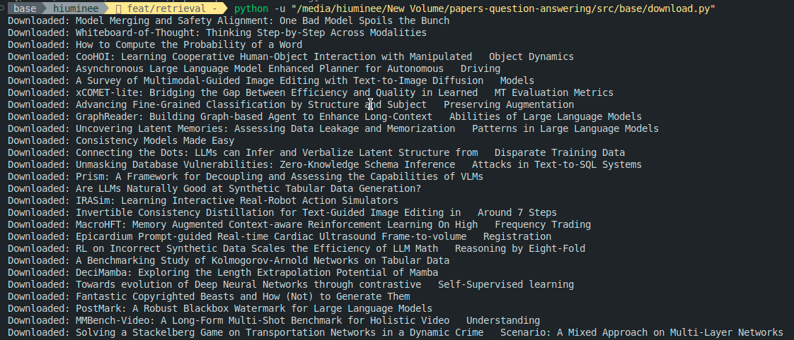

# Papers Question Answering

## Overview

The Question Answering (QA) feature is designed to provide users with concise answers to their queries based on a collection of research papers. It leverages a combination of natural language processing (NLP) techniques, including document retrieval and language model inference, to understand the context of a question and generate relevant answers.


## Architecture

The QA feature is built upon a RAG modular architecture, consisting of several key components:


### 1. Document Retrieval

- **Path**: [`src/retrieval.py`](src/retrieval.py)
- **Description**: This module is responsible for fetching relevant documents from a pre-processed database of research papers. It uses vector similarity search to find documents that are contextually similar to the user's query.
- **Key Components**:
  - `load_database`: Loads the vector database for similarity searches.
  - `create_prompt`: Generates prompts for the language model based on the retrieved documents.

### 2. Language Model Inference

- **Path**: [`src/base/llm_model.py`](src/base/llm_model.py)
- **Description**: This component handles the interaction with large language models (LLMs) to generate answers based on the context provided by the retrieved documents.
- **Key Components**:
  - `get_llm`: Fetches the specified LLM for generating answers.

### 3. Question Answering Tool

- **Path**: [`src/qa_tool.py`](src/qa_tool.py)
- **Description**: The core of the QA feature, this tool integrates document retrieval and language model inference to produce answers to user queries.
- **Key Components**:
  - `answer_question`: Orchestrates the QA process by retrieving relevant documents and generating answers using the LLM.

### 4. Summarization Tool (#developing #future_feature)

- **Path**: [`src/summarize_tool.py`](src/summarize_tool.py)
- **Description**: An auxiliary feature that provides summaries of research papers, aiding in understanding their content at a glance.
- **Key Components**:
  - `summarize_tool`: Generates summaries for given research papers using LLMs.

### 5. Web Interface

- **Path**: [`scripts/app.py`](scripts/app.py)
- **Description**: A Streamlit-based web application that serves as the user interface for the QA feature, allowing users to input questions and receive answers.
- **Key Components**:
  - Streamlit UI elements for input and output.

## Workflow

1. **User Query**: The user inputs a question into the web interface.
2. **Document Retrieval**: The system retrieves documents related to the query from the vector database.
3. **Prompt Generation**: A prompt is created based on the retrieved documents, guiding the LLM to generate contextually relevant answers.
4. **Answer Generation**: The LLM processes the prompt and generates an answer, which is then displayed to the user.

## Technologies

- **Streamlit**: For building the web interface.
- **LangChain**: For integrating LLMs and handling NLP tasks.
- **FAISS**: For efficient similarity search in the vector database.

## Setup and Usage

### Prerequisites

Before you begin, ensure you have the following installed on your system:

- Python 3.8 or higher
- pip (Python package installer)
- Git (for cloning the repository)

### Installation

Follow these steps to set up the Question Answering feature on your local machine:

1. **Clone the Repository**

   Open a terminal and run the following command to clone the project repository:

```bash
git clone https://github.com/your-repository/question-answering.git
cd question-answering
```

2. Create a Virtual Environment

It's recommended to create a virtual environment for Python projects. Run the following commands:

```bash
python3 -m venv venv
source venv/bin/activate
```

On Windows, activate the environment with:

```bash
.\venv\Scripts\activate
```

3. Install Dependencies

Install all the required Python packages using pip:

```bash
pip install -r requirements.txt
```

4. Set Up Environment Variable

Some components may require API keys or other environment variables. Create a .env file in the root directory and populate it with the necessary variables as described in the documentation _(I don't do that here for some convenience reasons, but it's not good practice, so be aware of this)_.

After that, you can use self-drive dataset or download some arXiV papers by using `python src/base/download.py`, create vector database by `python scripts/data_ingestion.py` and test the application by `streamlit run scripts/app.py`


## Conclusion

The Question Answering feature provides a powerful tool for extracting insights from a vast collection of research papers, making it easier for users to find answers to their research queries.
